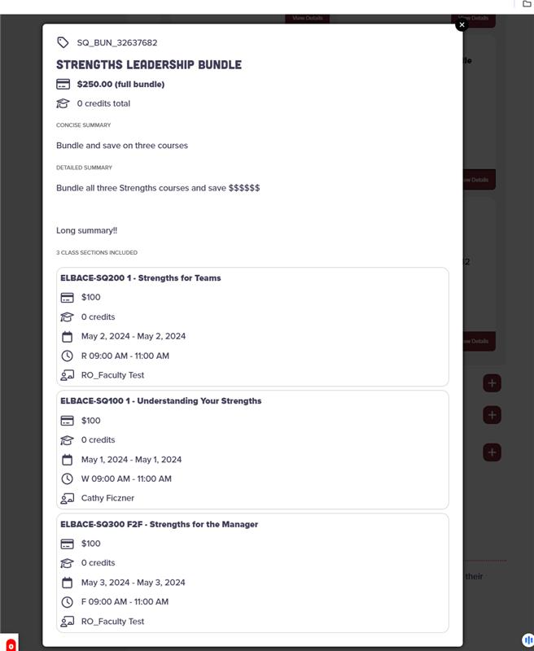

# Elevate Live Links Web Integration with Program Purchase Cart
This project is an integration of Ellucian Elevate Live Links with a PHP web page (source code sampled from intended destination of College of Charleston web page) using PHP, JS, and Velocity. Velocity is used to format data pulled from a populated Cascade CMS data definition. It's only relevant if you are using Cascade CMS, or any CMS leveraging Velocity for formatting. 

I was tasked with building this integration to allow for ad-hoc purchasing of continuing education programs on the College of Charleston website. I implemented the cart using sessionStorage, and the checkout links to the backend (paid) Elevate product and passes IDs of program instances as query parameters for purchase. The Elevate product recognizes those IDs and calculates the total cost on the backend which ideally matches the cost displayed in the front end cart. 

In short, the integration displays a set of specified "course streams" as accordions. Inside each course stream accordion, it displays a grid of program instances, where each instance belongs to the parent course stream. A program instance may be open for registration, closed, or full. If full, it checks if there are any open spots in the waitlist for the instance. If the course is open/not full, we allow the user to add the instance to their cart and charge the full instance fee. If the course is full but the waitlist is open, they can "Join Waitlist" which adds to the cart with a fee of $0 since Elevate does not charge for waitlisting. 

Each program instance also has a set of class sections, with each class section containing a set of "tutorials" which are objects that store meeting times, start and end dates, and the instructor. When you click View Details on any program instance card, you are presented with all of this lower-level information in a sub-card format (inside a modal). 

Note: I made sure to build this for mobile first, so it loads well on both mobile and desktop viewports.

# Screenshots

## Course stream accordions fully collapsed

## Expanded course stream accordion - program instance card grid

## View Program Instance Details (Modal)

## Program Instance Cart

## Program Instance Cart - View Item Details

## Checking out via Ellucian Elevate

## Run Locally 

To run locally, the easiest thing to do is use VSCode's PHP Server extension. Once you have that extension installed, you'll also need to have PHP installed, and you should point that extension's PHP Config setting to the path of your installed PHP executable. 

Then, you can right click anywhere inside of the [_test-elevate-programs-accordions.php](_test-elevate-programs-accordions.php) file and select PHP Server: Serve Project.

If you are building a similar integration for another institution, you'll need to change the `$sectionsURL` around line 734 in [_test-elevate-programs-accordions.php](_test-elevate-programs-accordions.php), and you'll neeed to change the `ELEVATE_URLS` in [elllucian-elevate-shopping-cart.js]. You'll also want to change the `$elevateCourseStreams` array in [_test-elevate-programs-accordions.php](_test-elevate-programs-accordions.php)

## Important note
None of the information in this project is secret. There are no credentials involved with fetching this course data. 